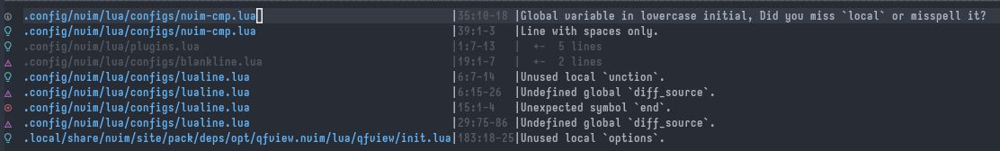

# Pretty quickfix/location view with smart path-shorten and folding

qfview.nvim makes your quickfix/location window look nicer and function better. Meant to be the successor of [nvim-pqf](https://github.com/yorickpeterse/nvim-pqf).



## Features

- Consistent, aligned, shorten text display
- Highlights for the item type (error, warning, etc)
- Same file based folding
- Works with both quickfix and location window

qfview.nvim uses Neovim's built-in diagnostic signs to highlight the item type. You can change your diagnostic symbols following [this instruction](https://github.com/neovim/nvim-lspconfig/wiki/UI-Customization#change-diagnostic-symbols-in-the-sign-column-gutter).

## Requirements

Recent Neovim.

## Installation

Install this plugin using your plugin manager of choice. For example, when using [vim-plug](https://github.com/junegunn/vim-plug):

    Plug 'ashfinal/qfview.nvim'

Then add the following lua snippet to your `init.lua`:

```lua
require('qfview').setup()
```

When using [lazy.nvim](https://github.com/folke/lazy.nvim):

```lua
{
  "ashfinal/qfview.nvim",
  event = "UIEnter",
  config = true,
},
```

## Configuration

We don't have any configuration options yet.

## License

MIT.
